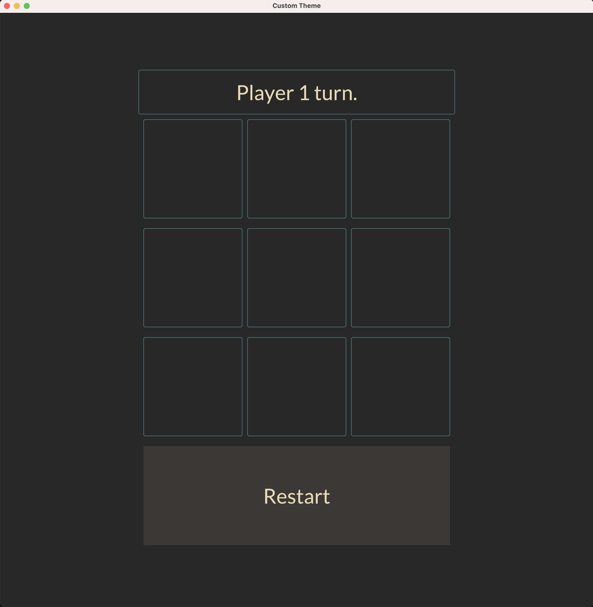
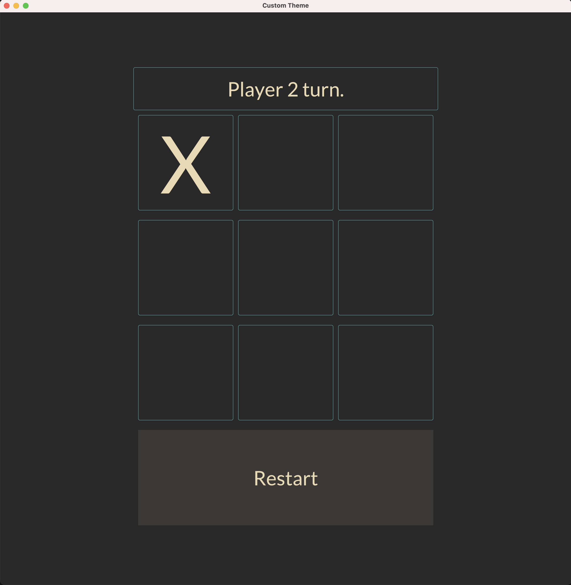
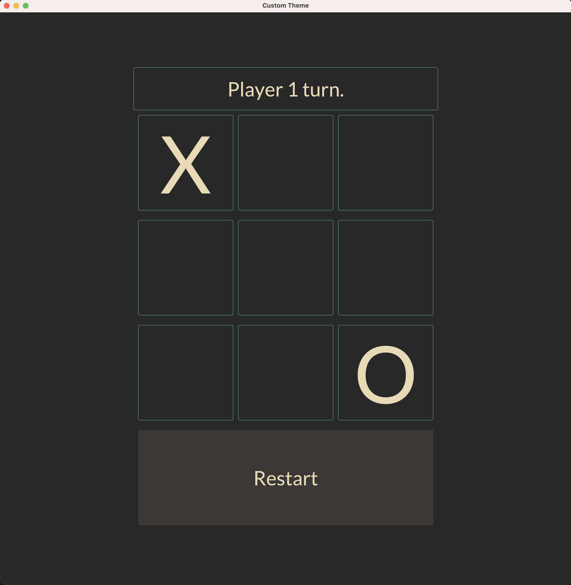
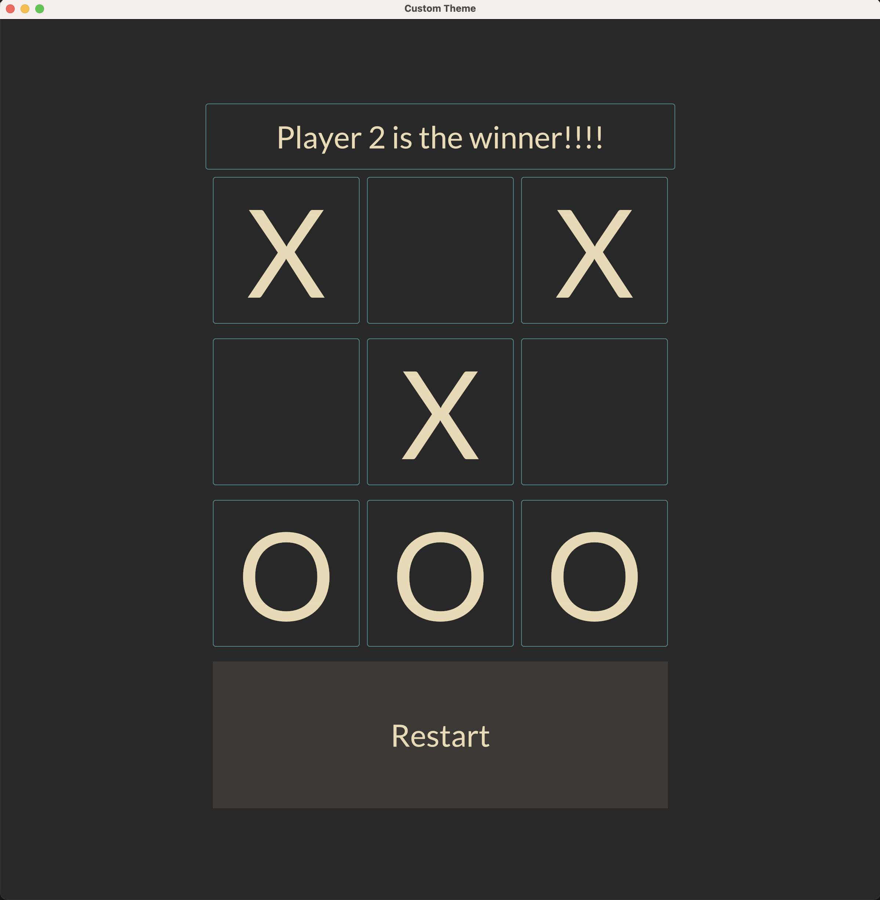

<div align="center">
  
# Tic Tac Toe Iced

<table>
  <tr>
    <td>
      
    </td>
    <td>
      
    </td>
    <td>
      
    </td>
    <td>
      
    </td>
  </tr>
</table>

</div>

TicTacToeIced is a faithful implementation of the traditional Tic Tac Toe game. Developed as an open-source project, it is meticulously crafted to capture the essence of the game, offering an engaging experience for players. Written in Rust, a high-performance programming language known for its efficiency and safety, TicTacToeIced ensures optimal performance and robustness. The game is built using the Iced GUI library, which provides a user-friendly interface and facilitates smooth interactions, allowing players to enjoy seamless gameplay and intuitive controls.


<a href="https://github.com/iced-rs/iced">
  
</a>

## Usage

To use TicTacToeIced, you can build it from source.

1. Clone the repository:

```
git clone https://github.com/alexmallet/TicTacToeIced.git
```

2. Build the project:

```
cd TicTacToeIced
cargo build --release
```

3. Run TicTacToeIced:

```
cargo run --release
```

## Why?
<div align="center">
My intention in doing this was to enhance my understanding of Rust and Iced. However, it does not aim to establish or endorse best practices. I welcome all constructive comments.  
</div>

## Features
- [x] Two players game:
  * It offers a platform for two players to battle each other, with the game ending once a definitive winner is crowned or a draw is settled. 
- [ ] Single player game:
  * In single-player mode, the player competes against the computer. The game concludes either when a definitive winner is determined or when a draw is reached.
  - [ ] Level Easy
  - [ ] Level Medium
  - [ ] Leve Hard 


## License

TicTacToeIced is released under the GPL-3.0 License. For more details, see the [LICENSE](LICENSE) file.

## Disclaimer

TicTacToeIced is still in the early stages of development. Bugs and incomplete features may be present. Use it at your own risk.

## Contact

For any questions, suggestions, or issues, please open an issue on the [GitHub repository](https://github.com/alexmallet/TicTacToeIced/issues).

